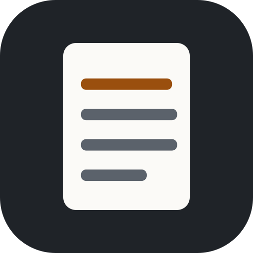
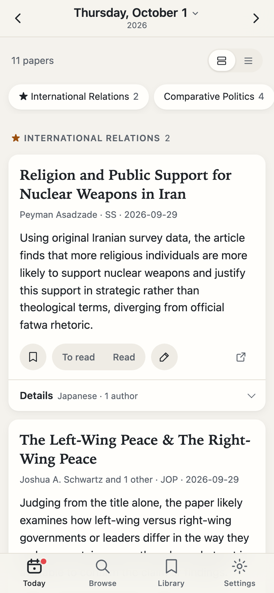
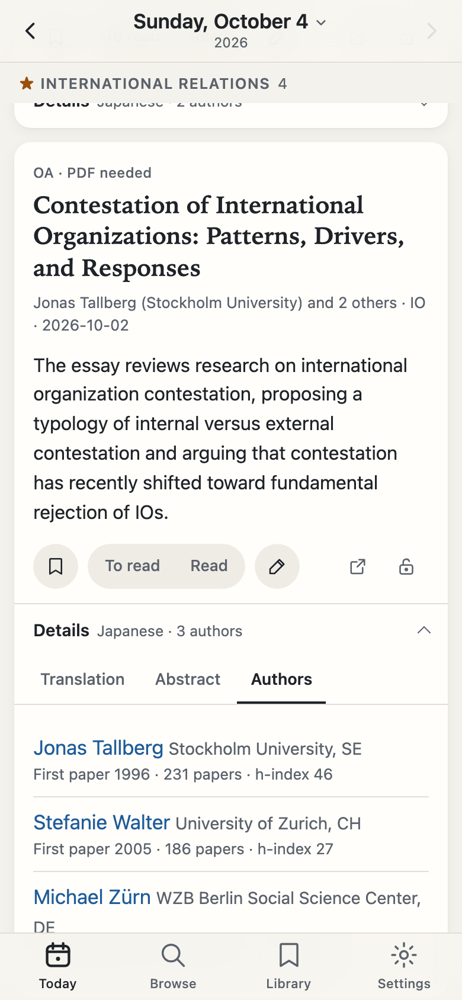
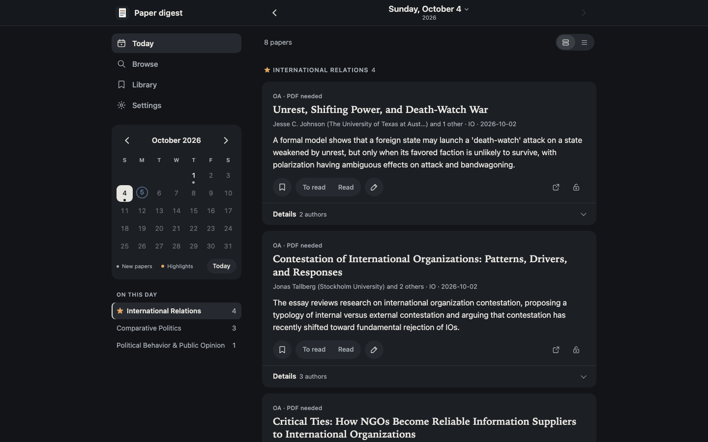

<p align="center">
  
</p>
<h1 align="center">Paper Digest</h1>
<p align="center">A personal morning digest of new political science papers, readable on a phone or a desktop.</p>

<p align="center">
  
  &nbsp;&nbsp;
  
</p>
<p align="center">
  
</p>

## What it does

- Collects each morning's new papers from a chosen set of journals.
- Sorts them by field and adds a one-line English summary of each paper.
- Keeps every past day: a calendar to go back, and search across all papers by journal, field or words.
- Lets you save papers, mark them to read or read, add notes, and ask for a full-text summary of open-access papers.
- Sends a morning notification and shows the number of new papers on the home-screen icon.

## How it works

```
GitHub Actions (hourly) ──► journal RSS feeds + OpenAlex ──► Claude API (fields, one-liners,
        │                                                     full-text summaries)
        ▼
    Firestore ◄──── this web app (static files on GitHub Pages, Firebase Auth)
        │
        └──► Firebase Cloud Messaging ──► notifications on the phone and desktop
```

This repository holds only the page code (HTML, CSS and JavaScript, no build step). The
processing scripts and the data are kept private.

## Build your own

- **You need:** a GitHub account, a Firebase project (Firestore, Authentication, Cloud
  Messaging), an Anthropic API key, and the free OpenAlex API.
- **Rough path:** (1) a script on your computer that fetches new papers and writes a digest;
  (2) a scheduled GitHub Actions job that runs it every morning and stores the results in
  Firestore; (3) a small web app that reads them, then sign-in and security rules, then
  notifications.
- **Cost:** a few dollars a month for the Claude API for about fifteen journals; the
  Firebase and GitHub free tiers cover the rest.
- **Watch out for:** abstracts belong to the publishers, so keep them behind sign-in rather
  than on a public page; keep API keys and service-account files out of
  synced folders (iCloud, Dropbox) and out of the repository; many publishers do not allow full
  texts to be downloaded automatically, so some summaries need a PDF you download yourself; and
  GitHub's scheduled runs can start late, sometimes by an hour or more.
- This project was written with an AI coding assistant, [Claude Code](https://claude.com/claude-code).
